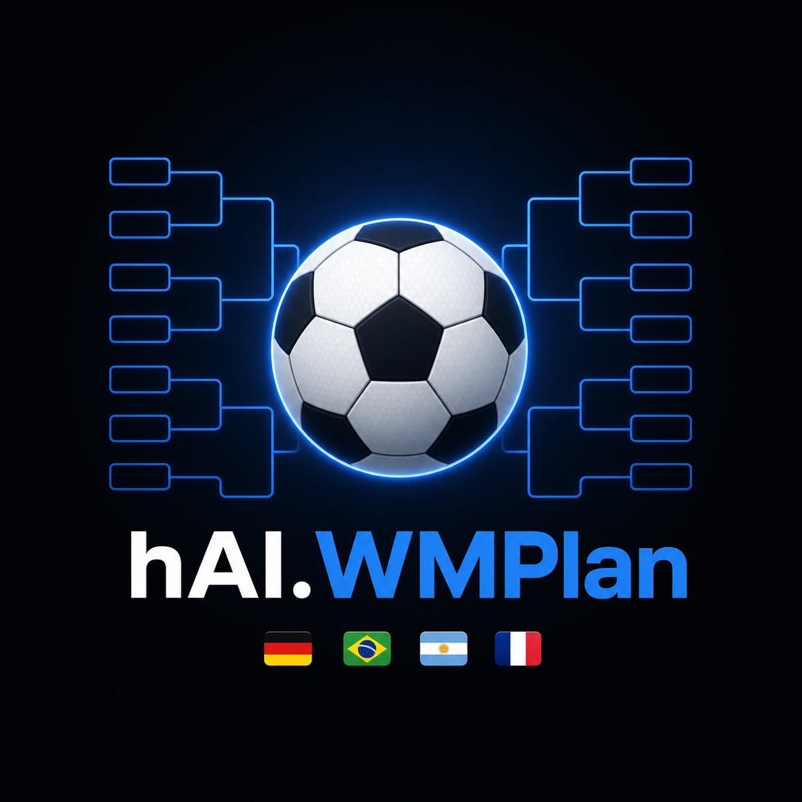

# ⚽ hAI.WMPlan – FIFA WM 2026 Turnierplan Webapp

<p align="center">
  
</p>

<p align="center">
  
  
  
  
  
  
  
  
  
  
  
  
</p>

Interaktive Single-File-Webapp zur Verwaltung des kompletten WM-2026-Turnierplans.

## Features

- 🏳️ **48 Teams** mit Länderflaggen (flag-icons 7.2.3 via jsDelivr + SRI)
- 🗂️ **12 Gruppen A–L** mit automatischer Tabellenberechnung (Pkt, Tore, +/-)
- 🏆 **K.o.-Bracket** Sechzehntelfinale → Finale mit automatischer Sieger-Weitergabe
- ⚽ **Elfmeter-Eingabe** bei Unentschieden in der K.o.-Phase
- 💾 Ergebnisse werden automatisch im `localStorage` gespeichert
- 🌙 / ☀️ Dark / Light Theme
- 🖨️ Print-optimiertes CSS
- 🔒 CSP-Header, SRI-Hash, XSS-Escaping, kein `eval()`, kein `window.confirm()`

## Datenbasis

Gruppen- und Teamzuordnung: **FIFA / Sportschau.de**, Stand 12.06.2026.

## Starten

Einfach `index.html` im Browser öffnen – keine Dependencies, kein Build-Prozess.

## Docker / Nginx

```nginx
server {
  listen 80;
  root /usr/share/nginx/html;
  index index.html;
}
```

```dockerfile
FROM nginx:alpine
COPY index.html /usr/share/nginx/html/
COPY logo.png /usr/share/nginx/html/
```

## Lizenz

MIT
